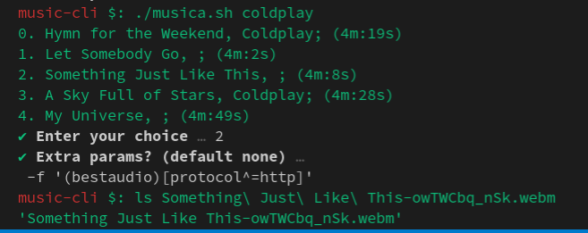

# music-cli(WIP)

Search for any song of your choice and have them downloaded locally using `youtbe-dl`



## Requirements

- nodeJs & npm
- [youtube-dl](https://github.com/ytdl-org/youtube-dl)

## Installation

- clone this repo

```bash
git clone https://github.com/aldrinjenson/music-cli.git
cd music-cli
npm install
chmod +x musica.sh
```

## Usage

```bash
./musica.sh <search_query>
```
